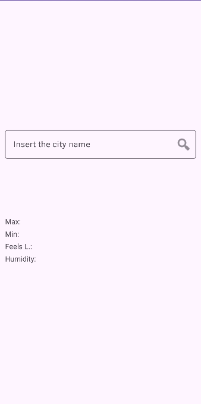
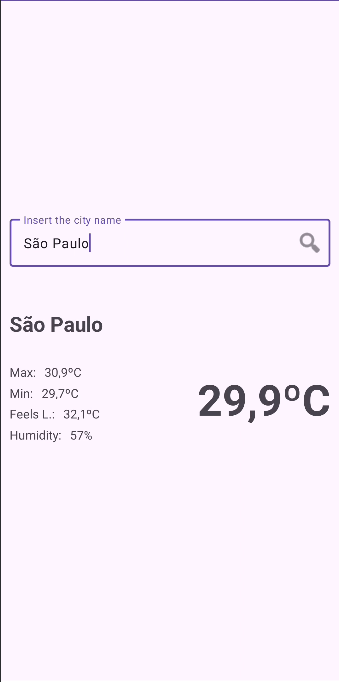

# Weather Forecast App

This Android application allows users to view the current weather forecast for a specified city. It
fetches data from the OpenWeatherMap API.

## Table of Contents

* [Features](#features)
* [App Preview](#app-preview)
* [Screenshots](#screenshots)
* [API Key](#api-key)
* [API Documentation](#api-documentation)
* [Build Environment](#build-environment)
* [Dependencies](#dependencies)
* [Usage](#usage)
* [Installation and Setup](#installation-and-setup)
* [TODO](#todo)
* [Contact](#contact)

## Features

* **City Search:** Easily find any city using the search bar.
* **Weather Forecast:**
    * View current temperature, minimum temperature, maximum temperature, humidity and feels like.
    * Display weather conditions (e.g., cloudy, sunny, rainy).
* **User-friendly Interface:** Designed for easy navigation and intuitive use.

## App Preview

* You can preview the app using the following link (opens in the current page)
* If you want to open it in a new tab use CTRL+click (on Windows and Linux) or CMD+click (on MacOS)
* [View Current Weather on Appetize.io](https://appetize.io/app/b_5ib26fr3e7uygukrycw5uwcysa)

* **Note:** This app preview is hosted on Appetize.io, which has a monthly usage limit. If you
  encounter any issues accessing the preview, please refer to the screenshots below for a visual
  representation of the app.

## Screenshots

 
|  | 
| :---: | :---: |

## API Key
* This app uses an external API. To ensure fair usage and prevent service disruption, the API key
  provided has a usage limit of 60 calls per minute and 1.000.000 calls per month.
* If you encounter an error message indicating that the request limit has been reached, please feel
  free to contact me through the information provided in
  the [Contact](#contact) section. I will be happy to provide you with a new API key.

## API Documentation

**OpenWeatherMap API**

* **Base URL:** https://api.openweathermap.org/data/2.5/
* **Endpoints Used:**
  <br>/weather (To get current weather data for a city)
  <br>
* **Request Parameters:**
  <br>q - city name
  <br>appid - API key
  <br>units - units of measurement (e.g., metric, imperial)
  <br>
* **Response Format:**
  <br>JSON responses following the OpenWeatherMap API schema. Refer to
  the [OpenWeatherMap API documentation](https://openweathermap.org/current) for detailed
  information about response structures.

## Build Environment

* **Kotlin:**  2.0.10
* **Target SDK:**  34
* **JVM Target:**  1.8

## Dependencies

* **Retrofit (2.11.0):**  For making network requests to the OpenWeatherMap API.
* **Gson (2.11.0):**  For parsing JSON data from the API.
* **Kotlin Coroutines:**  For managing asynchronous operations.
* **AndroidX ViewModel:**  For managing UI state and data.
  <br>

*for a detailed list of dependencies and their versions, please refer
to [DEPENDENCIES.md](docs/DEPENDENCIES.md)*

## Usage

1. Launch the app.
2. Enter the name of a city in the search bar.
3. View the current weather forecast for the city.

## Installation and Setup

1. **Clone the repository:**
   ```bash
   git clone https://github.com/iuryruansc/current-weather.git

2**Open the project in your IDE:**
<br>Android Studio is recommended.

3**Run the application:**
<br>Ensure your device or emulator is running Android 7.0 or higher.
<br>Click the "Run" button in your IDE.

## TODO

* Improve UI/UX design.
* Implement error handling and display appropriate messages to the user.
* Add support for displaying weather forecasts for multiple days.

## Contact

* **Maintainer:** Iury Ruan
* **Email:** iuryruansc@gmail.com